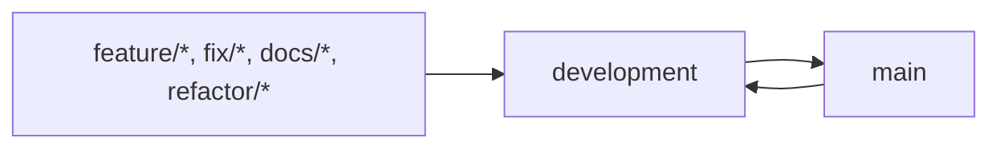

# Contributing to Ananke

Thanks for helping improve Ananke. This document describes the current contribution workflow for this repository.

* [Ways to Contribute](#ways-to-contribute)
* [Release Process](#release-process)
* [Before You Start](#before-you-start)
* [Reporting Bugs and Requesting Features](#reporting-bugs-and-requesting-features)
* [Branch Strategy](#branch-strategy)
  * [Long-lived branches](#long-lived-branches)
  * [Branch naming](#branch-naming)
* [Pull Request Workflow](#pull-request-workflow)
* [Circumventing Git Hooks](#circumventing-git-hooks)
* [Documentation Contributions](#documentation-contributions)
* [AI Guidelines](#ai-guidelines)
  * [Terminology](#terminology)
  * [Core Principle](#core-principle)
  * [Using AI for Code Contributions](#using-ai-for-code-contributions)
  * [Using AI for Communication](#using-ai-for-communication)
  * [Final Note](#final-note)
* [Attribution](#attribution)
* [License](#license)

## Ways to Contribute

* Report bugs
* Suggest enhancements
* Improve documentation
* Improve templates, styles, or assets
* Improve translations in `i18n/*.toml`

## Release Process

The project follows a structured release workflow based on conventional commits, staging branches, and automated versioning.

For details, see [Branch Strategy](#branch-strategy).

## Before You Start

1. Use a compatible Hugo version (see [`config/_default/module.toml`](https://github.com/gohugo-ananke/ananke/blob/main/config/_default/module.toml) for the current state).
2. Install dependencies:

```bash
npm install
```

1. Run a local preview via `npm run` instead of just calling `hugo server`:

```bash
npm run server
```

 This runs the documentation site from `site/` using contents from `docs/` with local configuration.

1. Follow the coding style and format commit messages as described in the conventional commits specification (for example: `docs: add troubleshooting section` or `fix: correct hero image path`).

2. Make sure to install git hooks for linting and testing before you push changes:

```bash
npm run prepare
```

 This command is run automatically after `npm install` but you can run it manually to set up hooks in an existing clone or update changed hooks. It uses `simple-git-hooks` to install a commit hook that runs `lint-staged` for markdown files, which in turn runs linting tasks on staged files.

## Reporting Bugs and Requesting Features

* Open bugs in [GitHub Issues](https://github.com/gohugo-ananke/ananke/issues).
* Start feature or idea discussions in [GitHub Discussions](https://github.com/gohugo-ananke/ananke/discussions).
* Include clear reproduction steps, expected behaviour, actual behaviour, and versions (`hugo version`, OS, browser if relevant).

## Branch Strategy



This repository uses a linear, rebase-based branch model. Long-lived branches MUST stay connected to `main`, and merge commits MUST NOT be introduced.

### Long-lived branches

| Branch | Purpose | Release role | Write policy | Merge |
| --- | --- | --- | --- | --- |
| `main` | Stable source of truth | releases | Protected. Only receives reviewed PRs from `development`. | Rebase |
| `development` | Active development | pre-releases | Feature, fix, chore, and documentation PRs target this branch. | Squash |

### Branch naming

Use short-lived branches for regular work:

* `feat/<topic>`
* `fix/<topic>`
* `docs/<topic>`
* `chore/<topic>`
* `refactor/<topic>`

After a successful rebase between those branches, push with lease:

```bash
git push --force-with-lease
```

## Pull Request Workflow

1. Fork the repository and create a focused branch.
2. Keep the change set small and cohesive (which means, DO NOT introduce multiple changes in a single PR).
3. Update docs for all user-facing changes.
4. Run quality checks locally:

```bash
npm run lint:markdown
```

1. If your change affects behaviour, validate with Hugo locally (for example `hugo` or `hugo server` in the relevant project).
2. Open a pull request with:

* a clear summary,
* motivation/context,
* screenshots when UI/visual output changes,
* linked issues (for example: `Fixes #123`).

## Circumventing Git Hooks

To prevent `git commit` and `git push` from running hooks you can use the `--no-verify` flag:

```bash
git commit --no-verify -m "docs: update README"
git push --no-verify origin my-feature-branch
```

This should be used sparingly and only when you have a good reason to bypass checks. If you find yourself needing to use `--no-verify` frequently, please consider improving the hooks or contributing fixes to reduce false positives.

## Documentation Contributions

The theme documentation lives in a separate repository at [gohugo-ananke/documentation](https://github.com/gohugo-ananke/documentation).

Please keep links relative where possible and remove stale references when updating pages.

## AI Guidelines

This section is based on a proposed guideline introduced in a pull request to Node.js ([PR #62105](https://github.com/nodejs/node/pull/62105)). This is a project-specific adaptation and applies to this repository.

### Terminology

* **AI** refers to any generative tool used to produce code or text (e.g. LLM-based systems).
* **LLM** refers specifically to large language models.
* **Tool** refers to any software used to assist development, including AI.

### Core Principle

**Contributions are made by people, not tools.**

AI is acceptable as a tool for any part of the workflow. However, responsibility cannot be delegated. Every contribution must be authored, understood, and defended by the person submitting it.

The answer to "Why is this an improvement?" must never be "I'm not sure, the AI did it."

Pull requests that contain changes the author does not fully understand or demonstrate a lack of understanding will be closed without review.

### Using AI for Code Contributions

AI may assist, but it must not replace judgement, understanding, or ownership.

When using AI as part of development:

* **Understand the codebase first.** Do not skip familiarisation with the relevant subsystem. AI frequently produces incorrect or outdated assumptions. Always verify against the actual source code in this repository.
* **Own every line you submit.** You are responsible for every change in your pull request, regardless of how it was created. PRs that contain changes the author does not fully understand will be closed without review.
* **No blind generation.** Do not generate large blocks of code and submit them without review. If you do not understand what the code does, do not include it.
* **Keep logical commits.** Structure commits in a clear and coherent way. Do not dump generated changes into a single commit. Follow the repository's commit message guidelines.
* **Test thoroughly.** AI-generated code must pass all tests and be validated manually. Never assume correctness because a tool suggested it. Do not remove or alter tests without explicit understanding and justification.
* **Edit generated output critically.** AI-generated code and comments are often verbose, redundant, or incorrect. Remove what is unnecessary or incorrect. Keep only what is necessary and accurate.
* **Stay accountable.** If you open a pull request, you are expected to follow through. Respond to feedback, iterate, and either complete or close the work yourself.

### Using AI for Communication

Communication must remain human, precise, and intentional.

* **No AI-only communication.** Do not submit comments, issue descriptions, or pull request texts that are entirely generated by AI.
* **Translations should be done using dedicated translation tools:** "English is not my first language" is not a reason to use AI to generate responses. Translate your own thoughts instead of outsourcing them.
* **Verify everything.** Any AI-assisted text must be checked for correctness before submission.
* **Complete templates properly.** Fill out pull request templates with actual information. Do not replace them with generated summaries. If you use AI to generate a PR then *prompt* your tool using the template to keep the format of the PR.
* **Reference real sources.** Link to actual code, documentation, or specifications within this repository or relevant upstream sources. Do not rely on AI statements as authority. If your AI is adding links verify they do exist. It remains your contribution and your responsibility.
* **Use tools for clarity, not substitution.** They must not replace direct, intentional communication.

### Final Note

AI is a tool. It can speed things up, help explore options, and reduce friction. It does not replace responsibility. If you submit a contribution, your name is on it. Act accordingly.

## Attribution

If you want to receive attribution for your contribution please follow the [contribution guidelines](https://allcontributors.org/en/bot/usage/) to add yourself to the list of contributors [in the Ananke theme documentation](https://github.com/gohugo-ananke/documentation/). A permanently open issue to add your contribution can be found [at the documentation repository](https://github.com/gohugo-ananke/documentation/issues/1). Read the initial message to understand how to add yourself to the list of contributors.

## License

By contributing, you agree that your contributions are provided under the repository license in [LICENSE.md](LICENSE.md).
